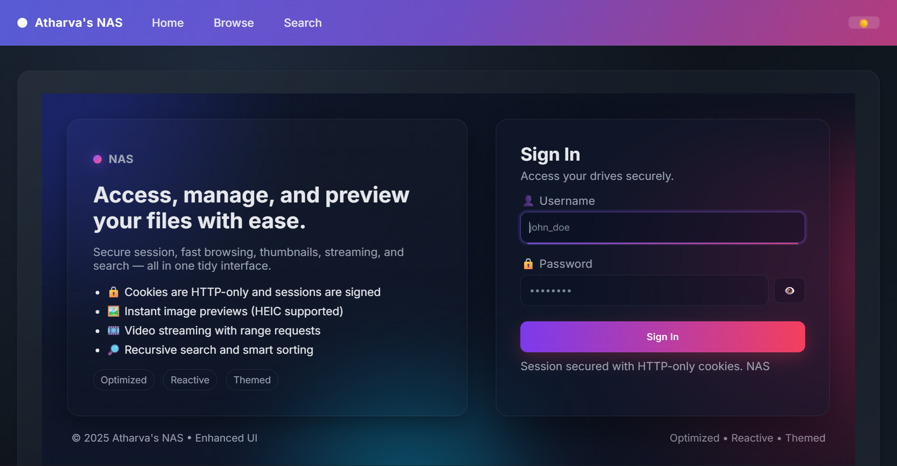
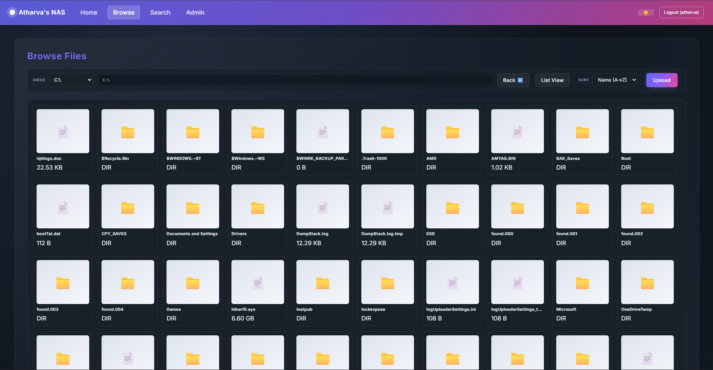
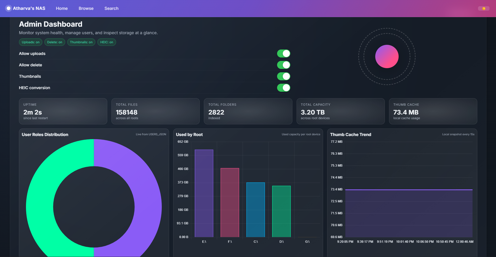

# NAS — HDD Browser (FastAPI)

A self-hosted file browser for local drives with authentication, role-based permissions, thumbnails, streaming, and search.

This guide walks you through a complete, from-scratch installation with minute detail, including environment setup, configuration, and optional remote access. Primary target is Windows; Linux/macOS notes are included where applicable.

---

## Screenshots

> Place the PNG files at docs/images/ as named below. If you don’t have them yet, create the folder and add your own screenshots with the same filenames.

| Login | Browse | Admin |
|---|---|---|
|  |  |  |

Architecture overview:


Recommended screenshots to capture:
- docs/images/login.png — The sign-in screen
- docs/images/browse.png — Browsing a folder with thumbnails
- docs/images/admin.png — Admin dashboard with users/stats
- docs/images/architecture.png — A simple diagram of browser → FastAPI → filesystem; optional

---

## Table of contents

- 0) What you get
- 1) Prerequisites
- 2) Clone the repository
- 3) Create a Python environment and install dependencies
- 4) Create and configure your .env
- 5) First run (local, without Tailscale)
- 6) Multi-user authentication (recommended)
- 7) Roles and permissions
- 8) Admin panel
- 9) Paths and allowed roots
- 10) Thumbnails, previews, HEIC, ffmpeg
- 11) Optional: remote access with Tailscale (Windows)
- 12) Autostart on boot (Windows)
- 13) Logs and debugging
- 14) API Reference (selected)
- 15) Troubleshooting
- 16) Updating
- 17) Full example .env (Windows, multi-user)
- 18) Repository layout
- 19) Security checklist (production)
- 20) License

---

## 0) What you get

- Authenticated web UI (role-based: admin, viewer, uploader, deleter)
- Browse multiple drives/directories (Windows drive letters supported)
- File preview (text, JSON, XML, YAML, PDF), inline viewers for DOCX/XLSX/CSV, thumbnails (images and videos)
- Stream media with HTTP range requests
- Upload and delete (gated by global flags and user roles)
- Search across allowed roots
- Admin panel: stats, user management, configuration visibility

---

## 1) Prerequisites

- Operating System:
  - Windows 10/11 (recommended and tested)
  - Linux/macOS should work with path adjustments (no drive letters; use POSIX paths)
- Python and Package Manager (choose one):
  - Anaconda/Miniconda (recommended) OR
  - System Python 3.10+ with pip
- Git for cloning
- Optional for remote access: [Tailscale](https://tailscale.com/) installed and logged in

---

## 2) Clone the repository

```bash
# PowerShell (Windows) or Bash (Linux/macOS)
git clone https://github.com/Atharva0177/NAS.git
cd NAS
```

---

## 3) Create a Python environment and install dependencies

Option A — Conda (recommended):

```bash
# Create env named "nas" with Python 3.10 (adjust version if needed)
conda create -n nas python=3.10 -y
conda activate nas

# Install Python dependencies
pip install -r hdd_browser/requirements.txt
```

Option B — System Python + pip:

```bash
# Ensure python --version is 3.10+ and pip is present
python -m venv .venv
# Windows:
.\.venv\Scripts\activate
# Linux/macOS:
source .venv/bin/activate

pip install -r hdd_browser/requirements.txt
```

Notes:
- The app reads configuration from a .env file via Pydantic; python-dotenv is supported when installed.
- If you see a warning about a weak or default session secret, set a strong SESSION_SECRET in your .env (see next section).

---

## 4) Create and configure your .env

The app auto-detects the nearest .env by walking up from hdd_browser/app/. Place your .env here:

- Path: hdd_browser/app/.env

Create the file if it doesn’t exist. Start from this template and edit to your needs.

```env
# --- Core ---
APP_NAME=NAS
HOST=0.0.0.0
PORT=8000
DEBUG=False

# --- Auth (legacy single-user; prefer USERS_JSON for multi-user) ---
AUTH_USERNAME=admin
AUTH_PASSWORD=admin

# IMPORTANT: Change to a long, random string (>= 16 chars)
SESSION_SECRET=change_this_to_a_long_random_value_32+chars

# --- Global features (must be True/1 for actions; roles further restrict) ---
ENABLE_UPLOAD=1
ENABLE_DELETE=1
ENABLE_THUMBNAILS=1
ENABLE_HEIC_CONVERSION=1
THUMB_MAX_DIM=256
THUMB_CACHE_DIR=.thumb_cache

# --- Allowed roots (comma-separated). Windows examples:
# Use drive roots OR specific folders. Quotes are optional unless you include commas/spaces.
ALLOWED_ROOTS=C:/,D:/,E:/,F:/,G:/

# --- Prefer .env values over OS env if python-dotenv is present ---
# Set to 1 to let .env override process env; set 0 to keep process env first.
HDD_ENV_OVERRIDE=1

# --- Multi-user JSON (preferred) ---
# IMPORTANT for Windows paths: EITHER use forward slashes OR double-escape backslashes.
# Forward slashes (simplest):
# USERS_JSON='[{"username":"admin","password":"change_me","roles":["admin"],"roots":[]},{"username":"view","password":"view_pw","roles":["viewer"],"roots":["F:/Media","D:/NAS"]}]'
#
# Or escaped backslashes (JSON rules):
# USERS_JSON='[{"username":"admin","password":"change_me","roles":["admin"],"roots":[]},{"username":"view","password":"view_pw","roles":["viewer"],"roots":["F:\\\\Media","D:\\\\NAS"]}]'
#
# Roles:
# - admin    → all permissions + admin panel
# - uploader → can upload (if ENABLE_UPLOAD=1)
# - deleter  → can delete (if ENABLE_DELETE=1)
# - viewer   → browse/search/preview/download
USERS_JSON='[{"username":"admin","password":"change_me","roles":["admin"],"roots":[]},{"username":"view","password":"view_pw","roles":["viewer"],"roots":["F:/Media"]}]'
```

Important notes about USERS_JSON:
- Must be valid JSON (no trailing commas, double quotes for keys/strings).
- Windows paths must use forward slashes or double-escaped backslashes:
  - OK: "F:/Google Photos Backup"
  - OK: "F:\\\\Google Photos Backup"
  - NOT OK: "F:\Google Photos Backup" (invalid JSON due to unescaped backslash)
- Each user can have:
  - username, password, roles
  - roots (optional): per-user allowed roots. They’re normalized to absolute paths.
- Global ALLOWED_ROOTS still apply. A user’s roots are intersected with global allowed roots.

Security notes:
- Replace AUTH_PASSWORD and SESSION_SECRET with strong values.
- If you fully migrate to USERS_JSON, you can clear AUTH_USERNAME/AUTH_PASSWORD to avoid legacy fallback.

---

## 5) First run (local, without Tailscale)

Run the app directly with uvicorn:

```bash
# From repo root (NAS/)
# Ensure your env is active (conda activate nas or source .venv/bin/activate)
python -m uvicorn hdd_browser.app.main:app --host 0.0.0.0 --port 8000
```

Or use the included Windows helper (opens a browser and runs readiness checks):

- File: NAS.bat (at repo root)
- It sets sensible defaults and can open a custom URL.
- To run:
  1) Open “Anaconda Prompt” or a terminal where conda is on PATH
  2) cd to NAS/
  3) Run:
     ```
     NAS.bat nas
     ```
     where “nas” is your conda environment name.

Access the app:
- Local: http://localhost:8000/
- Login page: http://localhost:8000/auth/login
- Admin panel: http://localhost:8000/admin (requires admin role)
- Health: http://localhost:8000/healthz

Tip: On first run, folders for thumbnails etc. are created as needed (e.g., .thumb_cache).

---

## 6) Multi-user authentication (recommended)

- Define users in USERS_JSON in your .env as shown above.
- Assign roles per user. Global feature flags must be enabled for actions.
- Per-user roots:
  - Optional; if omitted, the user falls back to global ALLOWED_ROOTS.
  - If provided, they’re intersected with ALLOWED_ROOTS.
  - Paths should exist and be directories; invalid entries are skipped during normalization.
- Login workflow:
  1) App reads USERS_JSON.
  2) If valid and non-empty → multi-user mode is active.
  3) If empty → legacy single-user mode uses AUTH_USERNAME/AUTH_PASSWORD.

Troubleshooting login:
- If you can’t log in with USERS_JSON users:
  - Validate your JSON (check escaping on Windows paths).
  - Remove trailing commas.
  - Ensure passwords match exactly; no hidden whitespace.
  - Clear cookies (session cookie: hdd_session) and retry.
  - Check terminal logs for “Invalid credentials”.

---

## 7) Roles and permissions

- Global flags must be enabled (ENABLE_UPLOAD, ENABLE_DELETE) AND the user needs the corresponding role.
- admin: all actions + access to /admin
- uploader: can upload when ENABLE_UPLOAD=1
- deleter: can delete when ENABLE_DELETE=1
- viewer: read-only (browse/search/preview/download)

---

## 8) Admin panel

- URL: /admin (requires admin)
- Features:
  - Uptime, total files/folders, capacity, thumb cache usage
  - User listing (redacted passwords)
  - Create/update/delete users (persisted to .env)
  - Assign roles and allowed roots per-user
  - Charts for roles distribution and roots usage

Persistence:
- User edits are stored in .env as the USERS_JSON value.
- The system writes the JSON string as a single-quoted value to preserve escaping.

---

## 9) Paths and allowed roots

- Global ALLOWED_ROOTS is a comma-separated list of directories or drive roots.
  - Windows: C:/, D:/, F:/, or specific folders like D:/NAS, F:/Media
  - Linux/macOS: /, /mnt/storage, /srv/media, etc.
- Per-user roots (USERS_JSON → roots) are normalized to absolute paths and intersected with global ALLOWED_ROOTS.
- A path outside ALLOWED_ROOTS is rejected for browsing and file operations.

Common pitfalls:
- Missing or mistyped drive letters (ensure the drive exists).
- “Path not within global ALLOWED_ROOTS” when assigning a per-user root outside global allowlist.

---

## 10) Thumbnails, previews, HEIC, and ffmpeg

- ENABLE_THUMBNAILS=1: generate image/video thumbnails (cache in THUMB_CACHE_DIR)
- ENABLE_HEIC_CONVERSION=1: enable HEIC/HEIF support (via Pillow plugins)
- FFMPEG_PATH (optional): if ffmpeg is not on PATH, set this to its absolute path
- Max thumbnail dimension: THUMB_MAX_DIM (default 256)

---

## 11) Optional: remote access with Tailscale (Windows)

Tailscale provides a secure wireguard mesh. To expose the app:

1) Install Tailscale (service + tray UI) from tailscale.com and log in.
2) Optionally create an auth key in the Tailscale admin console (for unattended login).
3) Edit NAS.bat variables if needed:
   - CUSTOM_URL: set to your device’s .ts.net URL:
     ```
     set "CUSTOM_URL=https://your-device-name.ts.net/auth/login?next=/"
     ```
   - HOST/PORT if desired.
4) If using an auth key:
   - Open a terminal once and run:
     ```
     setx TAILSCALE_AUTHKEY tskey-xxxxxxxxxxxxxxxxxxxx
     ```
     Then open a new terminal.
5) Run:
   ```
   NAS.bat nas
   ```
6) The script:
   - Starts the Tailscale service and tray
   - Brings up the node (if key provided)
   - Launches the FastAPI app via uvicorn in a separate window
   - Waits for /healthz readiness
   - Opens CUSTOM_URL in your browser

Notes:
- Consider HTTPS for production (reverse proxy or Tailscale Serve/Funnel).
- Set SESSION_SECRET to a strong value.
- For public exposure, put the app behind an HTTPS proxy and enable secure cookies if applicable.

---

## 12) Autostart on boot (Windows)

Option A — Task Scheduler:
- Create a basic task “NAS Server”
- Trigger: At log on or At startup
- Action: Start a program
  - Program/script: cmd.exe
  - Arguments: /c "cd /d C:\path\to\NAS && NAS.bat nas"
- Run with highest privileges if drives require it
- Configure for Windows 10/11, user account with access to your drives

Option B — NSSM (Non-Sucking Service Manager):
```powershell
# Install nssm and run in elevated PowerShell
nssm install NAS "C:\ProgramData\Anaconda3\Scripts\conda.exe" run -n nas python -m uvicorn hdd_browser.app.main:app --host 0.0.0.0 --port 8000
# Set working directory to repo root
nssm set NAS AppDirectory C:\path\to\NAS
nssm start NAS
```
- If using NSSM with Tailscale, run Tailscale as a Windows service separately (default) and ensure login.

---

## 13) Logs and debugging

- Start the app from a terminal to see logs:
  ```
  python -m uvicorn hdd_browser.app.main:app --host 0.0.0.0 --port 8000
  ```
- Look for messages like:
  - “[config] Using .env file: …”
  - “[config] dotenv loaded (override/no override) …”
  - “[config] WARN: …”
- DEBUG=True in .env increases verbosity (don’t leave it on in production).
- /healthz returns {"status":"ok"} once the app is ready.

---

## 14) API Reference (selected)

- Auth
  - GET /auth/login — login page
  - POST /auth/login — form fields username, password; sets signed cookie
  - POST /auth/logout — clears session

- Drives and listing
  - GET /api/drives — authenticated
  - GET /api/list?drive_id=&rel_path=

- Files and previews
  - GET /api/preview?drive_id=&rel_path=
  - GET /api/download?drive_id=&rel_path=
  - GET /api/stream?drive_id=&rel_path=
  - GET /api/thumb?drive_id=&rel_path=&size=

- Search
  - GET /api/search?drive_id=&query=&depth=&limit=

- Health
  - GET /healthz → {"status":"ok"}

All endpoints except /auth/*, /static/*, /favicon.ico are protected.

---

## 15) Troubleshooting

- I can’t log in with USERS_JSON users
  - Validate USERS_JSON with an online JSON validator.
  - For Windows, ensure paths use forward slashes or double-escaped backslashes.
  - Remove trailing commas and comments.
  - Clear cookies for the site (cookie name: hdd_session) and retry.
  - Make sure AUTH_USERNAME/AUTH_PASSWORD aren’t conflicting (or clear them if fully migrated).

- Admin “Path not within global ALLOWED_ROOTS”
  - Add the parent path to ALLOWED_ROOTS or adjust the user’s roots to be inside global paths.

- Thumbnails don’t show
  - Ensure ENABLE_THUMBNAILS=1.
  - Set FFMPEG_PATH if ffmpeg isn’t on PATH (required for some video thumbnails).
  - Check THUMB_CACHE_DIR is writable.

- 401 Unauthorized on API calls
  - Login first at /auth/login, then retry.
  - Check if the session cookie is present and not expired.

- The .env isn’t being picked up
  - Ensure the file is at hdd_browser/app/.env.
  - Watch startup logs for “[config] Using .env file: …”.
  - If running under a service, confirm working directory and permissions.

---

## 16) Updating

```bash
# Pull latest
git pull

# Re-activate env and reinstall if requirements changed
conda activate nas   # or source .venv/bin/activate
pip install -r hdd_browser/requirements.txt

# Restart the app/service
```

Make a backup of your hdd_browser/app/.env before updating.

---

## 17) Full example .env (Windows, multi-user)

```env
APP_NAME=NAS
HOST=0.0.0.0
PORT=8000
DEBUG=False

AUTH_USERNAME=
AUTH_PASSWORD=
SESSION_SECRET=replace_with_a_long_random_string_32+chars

ENABLE_UPLOAD=1
ENABLE_DELETE=1
ENABLE_THUMBNAILS=1
ENABLE_HEIC_CONVERSION=1
THUMB_MAX_DIM=256
THUMB_CACHE_DIR=.thumb_cache

# Allow browsing only these roots
ALLOWED_ROOTS=C:/,D:/,F:/

# Prefer .env over OS env
HDD_ENV_OVERRIDE=1

# Multi-user configuration:
# - admin has full access (no per-user roots → falls back to ALLOWED_ROOTS)
# - viewer limited to F:/Media and D:/NAS (forward slashes for simplicity)
USERS_JSON='[
  {"username":"admin","password":"S3cureAdmin!","roles":["admin"],"roots":[]},
  {"username":"view","password":"ViewOnly!","roles":["viewer"],"roots":["F:/Media","D:/NAS"]}
]'
```

---

## 18) Repository layout

```
NAS/
├─ hdd_browser/
│  ├─ app/
│  │  ├─ main.py            # FastAPI app
│  │  ├─ auth.py            # Authentication & session
│  │  ├─ config.py          # Settings & .env handling
│  │  ├─ env_utils.py       # .env read/write, USERS_JSON helpers
│  │  ├─ security.py        # Public path rules, guards
│  │  ├─ drive_discovery.py # Drive enumeration & roots
│  │  ├─ file_ops.py        # List/preview/download/stream/upload/delete
│  │  ├─ thumbnailer.py     # Thumbnail rendering + cache
│  │  ├─ heic_init.py       # HEIC/HEIF plugins for Pillow
│  │  ├─ templates/         # Jinja2 templates (login, browse, admin, etc.)
│  │  └─ static/            # CSS/JS and assets
│  └─ requirements.txt      # Python dependencies
├─ NAS.bat                  # Windows launcher (optional)
└─ README.md                # This file
```

---

## 19) Security checklist (production)

- Use long random SESSION_SECRET.
- Strong per-user passwords; rotate periodically.
- Run behind HTTPS (reverse proxy or Tailscale Serve/Funnel).
- Restrict ALLOWED_ROOTS to only what you intend to expose.
- Limit admin users; verify roles regularly.
- Back up .env securely (contains credentials).
- Consider OS-level firewall rules to restrict access.

---

## 20) License

See repository for license information.

---

If you run into issues, please open an issue with:
- OS version
- Python version
- How you started the app (command or script)
- Your .env (redact secrets; include USERS_JSON structure and sample paths)
- Console logs and any UI error messages

Happy self-hosting!
